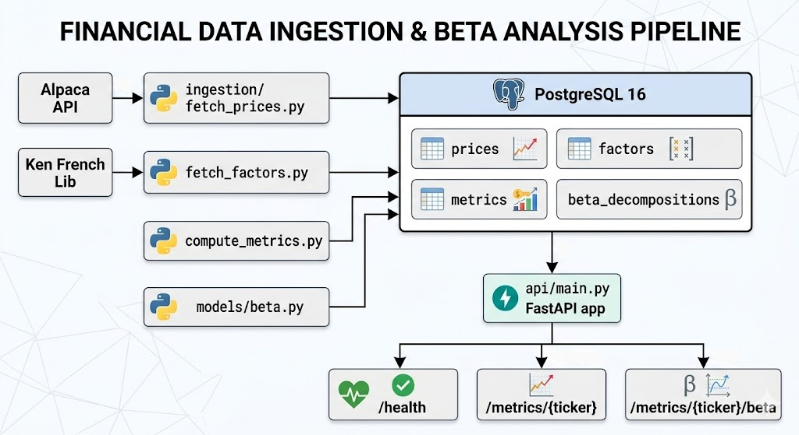

# AlphaForge

An automated quantitative finance data pipeline that ingests daily equity prices and
Fama-French factor data, computes CFA-aligned metrics, and exposes them through a
production-ready REST API. Built to demonstrate data engineering, financial modelling,
and software craftsmanship skills in a single deployable system.

---

## What It Does

1. **Ingests** daily OHLCV price data from the Alpaca Markets API and Fama-French
   3-factor data from the Ken French Data Library.
2. **Computes** log returns, rolling annualised volatility, Sharpe ratios, and
   Fama-French beta decompositions (market, size, value) via OLS regression.
3. **Persists** all data idempotently into PostgreSQL — safe to re-run at any time.
4. **Serves** all metrics through a FastAPI REST API with full Pydantic schema
   validation and auto-generated OpenAPI docs.
5. **Tests** every numerical invariant with property-based tests (Hypothesis) and
   every endpoint with HTTP-level integration tests (httpx).
6. **Ships** as a fully containerised application via Docker Compose.

---

## Tech Stack

| Layer | Technology |
|---|---|
| Data ingestion | Alpaca Markets API (`alpaca-py`), Ken French Data Library (`pandas-datareader`) |
| Database | PostgreSQL 16 |
| ORM | SQLAlchemy 2.0 |
| Metrics | pandas, NumPy, statsmodels (OLS) |
| API | FastAPI + Uvicorn |
| Validation | Pydantic v2 + pydantic-settings |
| Containerisation | Docker + Docker Compose |
| CI/CD | GitHub Actions |
| Testing | pytest + Hypothesis (property-based) + httpx |
| Dependencies | uv + pyproject.toml |
| Linting | Ruff |

---

## Financial Concepts Implemented

This project implements the following **CFA Level 1 Quantitative Methods** concepts
directly in production code:

| CFA Concept | Implementation |
|---|---|
| Continuously compounded returns | `ingestion/compute_metrics.py:log_returns()` |
| Annualised volatility (√252 convention) | `ingestion/compute_metrics.py:rolling_volatility()` |
| Sharpe ratio | `ingestion/compute_metrics.py:sharpe_ratio()` |
| Realised variance | `ingestion/compute_metrics.py:realised_variance()` |
| CAPM market beta | `models/beta.py:compute_capm_beta()` |
| Fama-French 3-factor model | `models/beta.py:compute_ff3_beta()` |
| EWMA volatility | `models/volatility.py:rolling_ewma_vol()` |

All return calculations use **log returns only** — `pd.DataFrame.pct_change()` and
simple returns are explicitly prohibited throughout the codebase.

---

## API Endpoints

Once running, interactive docs are available at `http://localhost:8000/docs`.

| Method | Endpoint | Description |
|---|---|---|
| `GET` | `/health` | Liveness probe |
| `GET` | `/metrics/{ticker}` | Latest log return, rolling vol, Sharpe ratio |
| `GET` | `/metrics/{ticker}/beta` | Fama-French 3-factor beta decomposition |
| `GET` | `/metrics/{ticker}/volatility` | Full rolling volatility time series |

---

## Architecture



---

## Project Structure

```
AlphaForge/
├── config.py                    # Pydantic BaseSettings (reads .env)
├── pyproject.toml               # Dependencies + tool config
├── Dockerfile
├── docker-compose.yml
│
├── ingestion/
│   ├── fetch_prices.py          # Alpaca → PostgreSQL
│   ├── fetch_factors.py         # Ken French FF3 → PostgreSQL
│   ├── compute_metrics.py       # Pure financial metric functions
│   ├── constants.py             # TRADING_DAYS_PER_YEAR = 252
│   └── utils.py                 # Retry decorator, rate limiter
│
├── db/
│   ├── models.py                # SQLAlchemy ORM (Price, Factor, Metric, Beta)
│   ├── session.py               # Engine + session factory + FastAPI dependency
│   ├── schema.sql               # Reference DDL
│   └── migrations/              # Numbered SQL migration files
│
├── models/
│   ├── beta.py                  # CAPM + FF3 OLS via statsmodels
│   └── volatility.py            # EWMA rolling volatility
│
├── api/
│   ├── main.py                  # FastAPI app + lifespan
│   ├── schemas.py               # Pydantic I/O models
│   ├── services.py              # Business logic layer
│   ├── dependencies.py          # DB session injection
│   └── routers/
│       ├── health.py
│       └── metrics.py
│
└── tests/
    ├── conftest.py              # SQLite fixtures, sample data, TestClient
    ├── test_metrics.py          # Hypothesis property-based tests
    └── test_api.py              # HTTP endpoint integration tests
```

---

## Getting Started

### Prerequisites

- Docker and Docker Compose
- A free [Alpaca Markets](https://app.alpaca.markets/signup) paper trading account
- [uv](https://docs.astral.sh/uv/) (Python package manager)

### Setup

```bash
git clone https://github.com/your-username/AlphaForge.git
cd AlphaForge

cp .env.example .env
# Edit .env and fill in your ALPACA_API_KEY and ALPACA_SECRET_KEY

uv sync --all-extras
```

### Run the full stack

```bash
docker compose up -d               # Start PostgreSQL

uv run python -m ingestion.fetch_prices    # Ingest equity prices
uv run python -m ingestion.fetch_factors   # Sync FF3 factors

uv run uvicorn api.main:app --reload       # Start API on :8000
```

Visit `http://localhost:8000/docs` for the interactive API documentation.

### Run tests

```bash
uv run pytest tests/ -v
uv run pytest tests/ -v --hypothesis-seed=0   # Deterministic property tests
```

### Lint

```bash
uv run ruff check .
```

---

## Design Decisions

**Log returns, not simple returns.** All calculations use `np.log(P_t / P_{t-1})`.
This is consistent with CFA convention and makes multi-period returns additive.

**Idempotent ingestion.** Every `INSERT` uses `ON CONFLICT DO NOTHING`. Scripts can be
re-run at any time without data corruption.

**No logic in route handlers.** Every handler is a one-liner that calls a service
function. Business logic lives in `api/services.py` and `ingestion/compute_metrics.py`.

**Property-based testing.** Numerical invariants (log return additivity, non-negative
variance, Sharpe NaN on zero-volatility input) are tested with Hypothesis — generating
thousands of random inputs rather than fixed examples.

**Lazy database engine.** The SQLAlchemy engine is created on first use, not at import
time. This allows tests to inject a SQLite engine before any database connection is made.

**Free, stable data sources only.** Alpaca provides a documented, free paper-trading
API. The Ken French Data Library provides free factor data directly — no API key
required.

---

## CI/CD

GitHub Actions runs on every push to `main` and every pull request:

1. Installs dependencies via `uv sync`
2. Runs `ruff check .` (linting)
3. Runs `pytest tests/ -v` (22 tests)

---

## Roadmap

- [ ] GARCH(1,1) volatility model (`models/volatility.py:garch_stub()`)
- [ ] Scheduled ingestion via APScheduler or Celery
- [ ] Prometheus metrics endpoint for observability
- [ ] Portfolio-level Sharpe ratio and correlation matrix endpoint
- [ ] Frontend dashboard (Streamlit or React)
